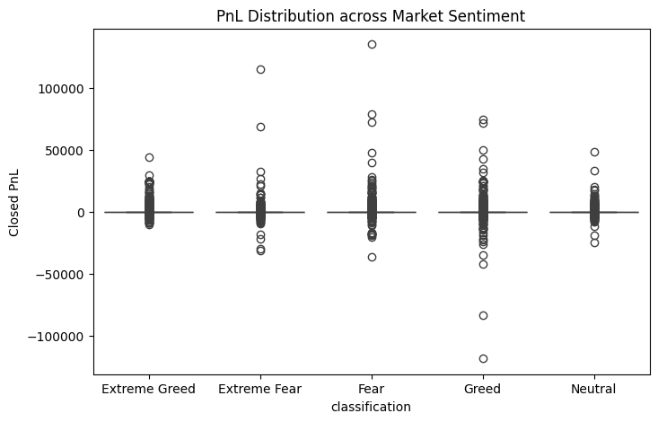
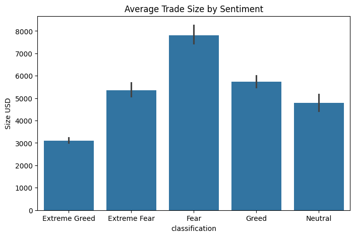
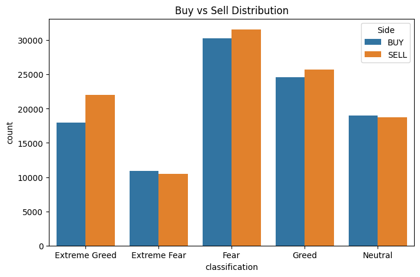
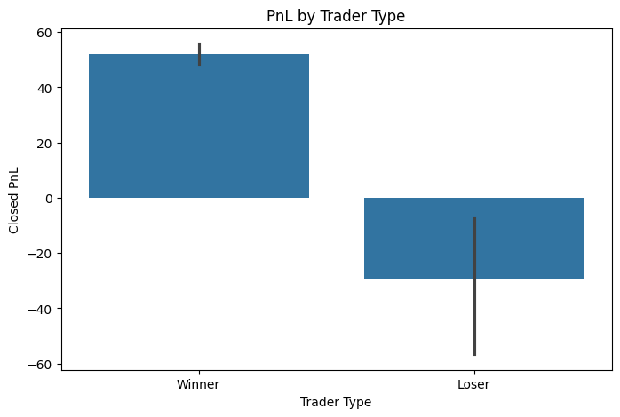

#  Trader Performance vs Market Sentiment Analysis

##  Objective
This project analyzes how Bitcoin market sentiment (Fear/Greed index) impacts trader behavior and performance on Hyperliquid. The goal is to uncover patterns that can inform more effective, data-driven trading strategies.

---

##  Methodology

### Data Preparation
- Loaded Bitcoin Fear/Greed dataset and Hyperliquid trader dataset
- Cleaned missing values and removed duplicates
- Converted timestamps to datetime format (`dayfirst=True` for trade data)
- Aggregated data at a daily level
- Merged datasets on the `date` column to align sentiment with trading activity

### Feature Engineering
Key metrics created:
- Profit & Loss (Closed PnL)
- Win rate (profitable trades %)
- Trade size (USD)
- Trade frequency (number of trades)
- Buy/Sell distribution

### Segmentation
- Winners vs Losers (based on total PnL)
- Frequent vs Infrequent traders
- Large vs Small trades (based on median size)

---

##  Key Insights

###  Insight 1: Momentum-driven profitability in Extreme Greed
Trader profitability peaks during *Extreme Greed* periods, indicating that strong bullish momentum enables traders to capture trend-following gains more effectively.

###  Insight 2: Volatility-driven opportunities during Fear
Fear periods show higher profitability than standard Greed conditions, suggesting traders capitalize on volatility and market corrections.

###  Insight 3: Market extremes outperform neutral conditions
Both Extreme Fear and Extreme Greed outperform Neutral markets, highlighting that strong sentiment and volatility provide better trading opportunities.

###  Insight 4: Risk-taking behavior increases in Greed
Trade sizes increase during Greed phases, indicating higher risk appetite, which contributes to amplified returns in bullish conditions.

###  Insight 5: Trader behavior adapts to sentiment
Trading activity and Buy/Sell patterns vary across sentiment regimes, showing that traders adjust strategies based on market conditions.

###  Insight 6: Experience drives performance
Frequent and consistently profitable traders outperform others, especially during high-momentum phases, emphasizing the importance of experience and adaptability.

###  Insight 7: Adaptability is key to success
Trader performance depends not just on sentiment, but on the ability to adjust behavior (risk, timing, frequency) based on market conditions.

---

##  Strategy Recommendations

- Increase exposure during Extreme Greed to capitalize on strong momentum
- Use Fear periods for selective opportunities such as dip-buying
- Avoid aggressive trading during Neutral markets due to low profitability
- Align trading strategy with experience level and risk tolerance

---

##  Visualizations







---

##  How to Run

1. Clone the repository:
```bash
git clone https://github.com/your-username/trader-sentiment-analysis.git
